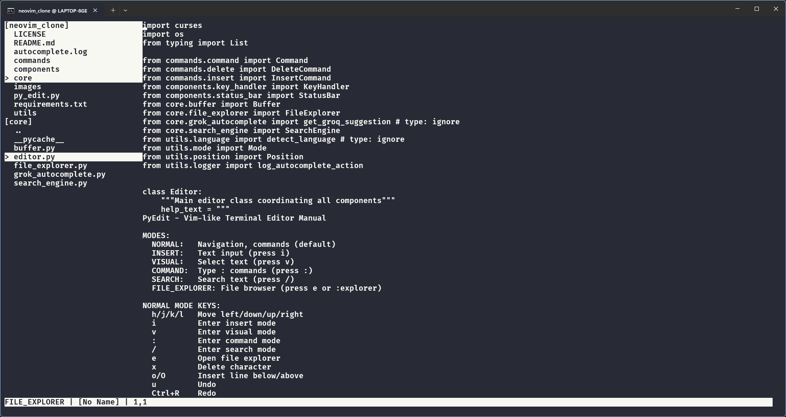

 # PyEdit - Vim-like Terminal Text Editor

PyEdit is a terminal-based text editor inspired by Vim, implemented in Python. It provides a modal editing experience, file explorer with live preview, search, undo/redo, and more—all within your terminal. PyEdit is designed for speed, efficiency, and extensibility, making it a great choice for developers who love working in the terminal.

---

<p align="center">
  
</p>

## Features

- **Modal Editing:** Normal, Insert, Visual, Command, Search, and File Explorer modes.
- **Vim-like Keybindings:** Familiar navigation and editing keys (`h/j/k/l`, `i`, `v`, `:`, `/`, etc.).
- **File Explorer Sidebar:** Browse and open files and directories, with a live preview pane that resizes with your terminal.
- **Search:** Powerful in-buffer and file search with regex support.
- **Undo/Redo:** Full undo/redo support for editing operations.
- **Status Bar:** Displays mode, file name, modification status, and cursor position.
- **Command Mode:** Save, quit, open files, and more with `:commands`.
- **Visual Mode:** Select, copy, and delete text visually.
- **AI Autocomplete:** (Optional) Press Tab in insert mode for AI-powered code suggestions (requires configuration).
- **AI Tools:** Use `:ai <action>` commands for code refactoring, documentation, explanation, translation, code generation, and more (see below).
- **Lightweight & Fast:** Minimal dependencies, runs in any terminal with Python and curses.

---

## Installation

### Requirements
- Python 3.7+
- Unix-like terminal (Linux, macOS, or Windows with WSL/compatible terminal)
- Python `curses` module (pre-installed on most Unix systems; for Windows, install `windows-curses` via pip)

### Setup
1. **Clone the repository:**
   ```bash
   git clone <repo-url>
   cd neovim_clone
   ```
2. **(Windows only) Install curses:**
   ```bash
   pip install windows-curses
   ```

---

## Usage

Run the editor from your terminal:

```bash
python py_edit.py [filename]
```
- If `[filename]` is provided, it will open or create that file.
- If not, a new buffer is opened.

---

## Keybindings & Modes

### Modes
- **NORMAL:** Navigation, commands (default)
- **INSERT:** Text input (press `i`)
- **VISUAL:** Select text (press `v`)
- **COMMAND:** Type :commands (press `:`)
- **SEARCH:** Search text (press `/`)
- **FILE EXPLORER:** File browser (press `e` or `:explorer`)


<div align="center">
  <p><b>Normal Mode Keys </b></p>
<table>
  <tr>
    <th style="text-align:center;">Key</th>
    <th style="text-align:center;">Action</th>
  </tr>
  <tr>
    <td style="text-align:center;">h/j/k/l</td>
    <td style="text-align:center;">Move left/down/up/right</td>
  </tr>
  <tr>
    <td style="text-align:center;">i</td>
    <td style="text-align:center;">Enter insert mode</td>
  </tr>
  <tr>
    <td style="text-align:center;">v</td>
    <td style="text-align:center;">Enter visual mode</td>
  </tr>
  <tr>
    <td style="text-align:center;">:</td>
    <td style="text-align:center;">Enter command mode</td>
  </tr>
  <tr>
    <td style="text-align:center;">/</td>
    <td style="text-align:center;">Enter search mode</td>
  </tr>
  <tr>
    <td style="text-align:center;">e</td>
    <td style="text-align:center;">Open file explorer</td>
  </tr>
  <tr>
    <td style="text-align:center;">x</td>
    <td style="text-align:center;">Delete character</td>
  </tr>
  <tr>
    <td style="text-align:center;">o / O</td>
    <td style="text-align:center;">Insert line below/above</td>
  </tr>
  <tr>
    <td style="text-align:center;">u</td>
    <td style="text-align:center;">Undo</td>
  </tr>
  <tr>
    <td style="text-align:center;">Ctrl+R</td>
    <td style="text-align:center;">Redo</td>
  </tr>
  <tr>
    <td style="text-align:center;">q</td>
    <td style="text-align:center;">Quit</td>
  </tr>
</table>
</div>

<div align="center">
  <p><b>Insert Mode</b></p>
<table>
  <tr>
    <th style="text-align:center;">Key</th>
    <th style="text-align:center;">Action</th>
  </tr>
  <tr>
    <td style="text-align:center;">ESC</td>
    <td style="text-align:center;">Return to normal mode</td>
  </tr>
  <tr>
    <td style="text-align:center;">Enter</td>
    <td style="text-align:center;">New line</td>
  </tr>
  <tr>
    <td style="text-align:center;">Backspace</td>
    <td style="text-align:center;">Delete</td>
  </tr>
  <tr>
    <td style="text-align:center;">Tab</td>
    <td style="text-align:center;">AI autocomplete (if enabled)</td>
  </tr>
</table>
</div>
 
<div align="center">
  <p><b>Visual Mode</b></p>
<table>
  <tr>
    <th style="text-align:center;">Key</th>
    <th style="text-align:center;">Action</th>
  </tr>
  <tr>
    <td style="text-align:center;">d</td>
    <td style="text-align:center;">Delete selection</td>
  </tr>
  <tr>
    <td style="text-align:center;">y</td>
    <td style="text-align:center;">Copy selection</td>
  </tr>
  <tr>
    <td style="text-align:center;">ESC</td>
    <td style="text-align:center;">Return to normal mode</td>
  </tr>
</table>
</div>

<div align="center">
  <p><b>Command Mode (`:`)</b></p>
<table>
  <tr>
    <th style="text-align:center;">Command</th>
    <th style="text-align:center;">Action</th>
  </tr>
  <tr>
    <td style="text-align:center;">w</td>
    <td style="text-align:center;">Save file</td>
  </tr>
  <tr>
    <td style="text-align:center;">wq</td>
    <td style="text-align:center;">Save and quit</td>
  </tr>
  <tr>
    <td style="text-align:center;">q</td>
    <td style="text-align:center;">Quit</td>
  </tr>
  <tr>
    <td style="text-align:center;">e &lt;file&gt;</td>
    <td style="text-align:center;">Open file</td>
  </tr>
  <tr>
    <td style="text-align:center;">w &lt;file&gt;</td>
    <td style="text-align:center;">Save as file</td>
  </tr>
  <tr>
    <td style="text-align:center;">explorer</td>
    <td style="text-align:center;">Toggle file explorer</td>
  </tr>
  <tr>
    <td style="text-align:center;">help</td>
    <td style="text-align:center;">Show help manual</td>
  </tr>
</table>
</div>

### Search Mode (`/`)
- Type pattern, Enter to search, ESC to cancel

## File Explorer (Ranger/Yazi-Style)

The file explorer is a two-pane sidebar:
- **Left pane:** Shows the directory stack and contents. Navigate with your keyboard.
- **Right pane:** Instantly previews the selected file (up to the full width of your terminal).
- **Toggle the explorer:**
  - Press `e` in normal mode
  - Or type `:explorer` in command mode (works from any mode)

<div align="center">
  <p><b>Explorer Navigation Keys</b></p>
<table>
  <tr>
    <th style="text-align:center;">Key</th>
    <th style="text-align:center;">Action</th>
  </tr>
  <tr>
    <td style="text-align:center;">j / Down</td>
    <td style="text-align:center;">Move down</td>
  </tr>
  <tr>
    <td style="text-align:center;">k / Up</td>
    <td style="text-align:center;">Move up</td>
  </tr>
  <tr>
    <td style="text-align:center;">l / Right / Enter</td>
    <td style="text-align:center;">Enter directory or open file</td>
  </tr>
  <tr>
    <td style="text-align:center;">h / Left / Backspace</td>
    <td style="text-align:center;">Go up to parent directory</td>
  </tr>
  <tr>
    <td style="text-align:center;">r</td>
    <td style="text-align:center;">Refresh file list</td>
  </tr>
  <tr>
    <td style="text-align:center;">q / ESC</td>
    <td style="text-align:center;">Exit file explorer</td>
  </tr>
</table>
</div>

- When you select a file and press Enter/l/right, it opens in the editor and exits explorer mode.
- When you select a directory and press Enter/l/right, it enters that directory.
- You can also use `:explorer` at any time to open the explorer.

---

## AI Tools

PyEdit features a suite of AI-powered tools accessible via the command mode. These tools leverage the Groq API to help you write, understand, and manage code more efficiently.

### Usage
Type `:ai <action> [args]` in command mode. Example:
```
:ai refactor
:ai doc
:ai explain
:ai testgen
:ai review
:ai nl2code create a function that sorts a list
:ai translate javascript
:ai search file I/O
:ai commitmsg
:ai chat How do I use decorators in Python?
:ai snippet HTTP GET request in Python
```

### AI Actions Explained

- **refactor**: Refactors the current buffer for readability and efficiency. The buffer is replaced with the improved code.
- **doc**: Generates a docstring or inline comments for the code in the buffer. The result is shown in a popup.
- **explain**: Explains what the code in the buffer does in plain English. The explanation is shown in a popup.
- **testgen**: Generates a unit test (e.g., pytest) for the code in the buffer. The buffer is replaced with the generated test code.
- **review**: Reviews the code in the buffer and suggests improvements or points out bugs. The review is shown in a popup.
- **nl2code <instruction>**: Converts a natural language instruction into code (e.g., `:ai nl2code create a function that sorts a list`). The buffer is replaced with the generated code.
- **translate <language>**: Translates the code in the buffer to another language (e.g., `:ai translate javascript`). The buffer is replaced with the translated code.
- **search <query>**: Performs a semantic search across all Python files in the project for code related to the query (e.g., `:ai search file I/O`). The results are shown in a popup.
- **commitmsg**: Generates a concise git commit message for the current buffer's content. The message is shown in a popup.
- **chat <message>**: Opens a chat with the AI for general programming questions or advice. The response is shown in a popup.
- **snippet <description>**: Generates a code snippet based on a description (e.g., `:ai snippet HTTP GET request in Python`). The buffer is replaced with the generated snippet.

#### Buffer-updating actions
- `refactor`, `nl2code`, `translate`, `snippet`, `testgen` will automatically replace the buffer with the AI's code output.

#### Popup actions
- `doc`, `explain`, `review`, `search`, `commitmsg`, `chat` will always show their result in a scrollable popup window, even for short responses.

---

## Screenshots

<p align="center">
  
</p>

<p align="center">
  
</p>

<p align="center">
  
</p>

<p align="center">
  
</p>

---

## Contribution

Contributions are welcome! Please open issues or submit pull requests for bug fixes, new features, or improvements.

---

## Credits

- Inspired by Vim and other modal editors.

---

## License

This project is licensed under the MIT License.